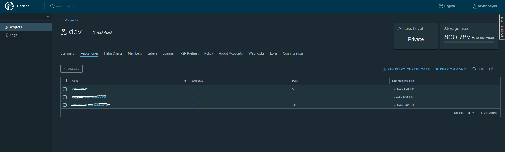
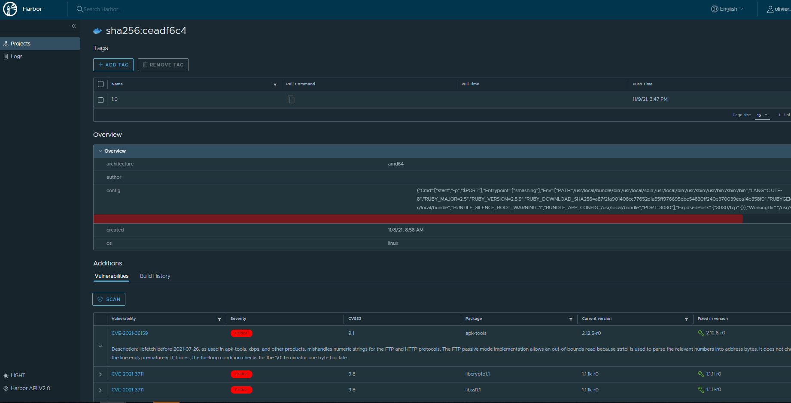

# Harbor

## Container et Helm Chart Registry
Harbor va vous donner l'opportunité d'avoir votre propre registry aussi bien pour les images docker que pour les helm chart.
Prévu pour fonctionner en multi tenancy, il permet de cloisonner en project afin de definir qui a accès aux images ou au charts.

## Couplage avec des scanners d'images type Trivy, Clair.
Fonctionnalité très intéressante, Harbor se couple très bien avec des scanners de vulnérabilités.
Il peut scanner régulièrement vos images, vous donner un rapport détaillé des vulnérabilités.
Autoriser ou pas le téléchargement des images où des CVE ont été découvertes. 

