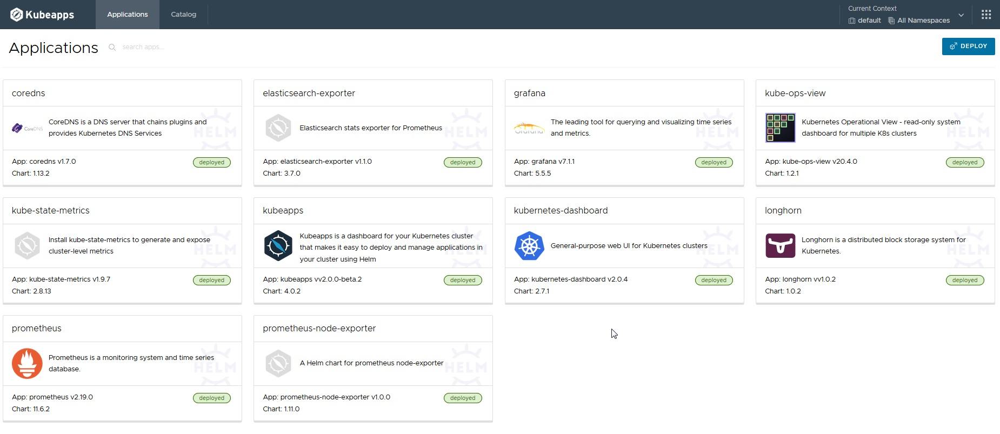

# Helm
Helm est un outil qui va servir à packager des logiciels sur kubernetes. 

## Le Helm Chart
Comme nous l'avons vu lors de cette formation, le nombre de fichiers yaml à produire pour installer un logiciel sur un cluster Kubernetes est conséquent.
Helm va permettre d'installer toutes ses ressources (Deploiement, Job, Role, ServiceAccount, Secret, configMap ...) en quelques lignes.
Il "templatise" ces ressources afin de permettre à chacun de les adapter au contexte à utiliser.
Le Chart est un fichier archive TGZ, qui contient tous les templates des objects K8S nécessaires, un fichier `value.yaml` qui va fournir des valeurs par défaut à utiliser pour peupler les variables des templates.
Chaque variable pouvant être modifié soit par l'usage d'un nouveau fichier yaml, soit par des affectations ponctuelles  ( --set key=valeur ) lors de l'usage de la cli helm.
Un chart peut lui-même s'appuyer sur d'autres chart (dépendance).

## Repository Helm
Un repository de Helm chart n'est en somme qu'un banal serveur web qui possède un fichier index.yaml.
Dans ce fichier, on retrouvera la liste des produits avec leur méta-donnée (numéro de version,auteurs,... et lieu où l'on peut télécharger le chart)

Exemple de contenu :

```yaml
apiVersion: v1
entries:
  airflow:
  - annotations:
      category: WorkFlow
    apiVersion: v2
    appVersion: 2.2.1
    created: "2021-10-30T11:01:25.771092252Z"
    dependencies:
    - name: common
      repository: https://charts.bitnami.com/bitnami
      tags:
      - bitnami-common
      version: 1.x.x
    - condition: postgresql.enabled
      name: postgresql
      repository: https://charts.bitnami.com/bitnami
      version: 10.x.x
    - condition: redis.enabled
      name: redis
      repository: https://charts.bitnami.com/bitnami
      version: 15.x.x
    description: Apache Airflow is a platform to programmatically author, schedule
      and monitor workflows.
    digest: eacc86fe88dd9bce16db8c52a8eb77841dd351b17655685899c3ef2f204641b2
    home: https://github.com/bitnami/charts/tree/master/bitnami/airflow
    icon: https://bitnami.com/assets/stacks/airflow/img/airflow-stack-220x234.png
    keywords:
    - apache
    - airflow
    - workflow
    - dag
    maintainers:
    - email: containers@bitnami.com
      name: Bitnami
    name: airflow
    sources:
    - https://github.com/bitnami/bitnami-docker-airflow
    - https://airflow.apache.org/
    urls:
    - https://charts.bitnami.com/bitnami/airflow-11.1.7.tgz
    version: 11.1.7
```

Pour utiliser un repo helm, il faut l'ajouter en lui donnant un nom :

```shell
helm repo add bitnami https://charts.bitnami.com/bitnami
helm repo update
```
> à noter rien ne vous empêche de donner le nom que vous souhaitez à un repo.

Il existe des outils tels que KubeApps qui permet d'avoir une bibliothèque de Helm Chart



et meme un moteur de recherche pour trouver les charts : [https://hub.helm.sh/charts](https://hub.helm.sh/charts)
## A savoir sur l'usage

Pour affecter une variable qui servira pour les templates, 
- les `-set key=valeur` sont prioritaires, 
- puis le(s) fichiers `values.yaml` fournit en ligne 
- puis enfin les valeurs présentent dans le fichier `values.yaml` du chart.

## Comprendre les différentes parties du chart
Il est très souvent utile pour comprendre comment fonctionne un chart, d'aller regarder son code.
Parmi les fichiers importants à regarder :

- Le fichier `value.yaml` va vous donner les valeurs par défauts qui seront utilisées lors du templating.
Il vous donnera aussi des informations via des commentaires sur des valeurs de paramètres possibles.

- Le fichier `Chart.yaml` va vous donner les dépendances à d'autres charts ainsi que des informations.

- Le fichier `templates/_helpers.tpl` va vous donner des macro-définitions que l'on pourra exploiter.

- Les fichiers `templates/*.yaml` les templates d'objects que vous voulez instancier.

- Le fichier `README.md` (attention à la caste) sera utilisé par les outils qui présentent les charts sous forme de bibliothèques.

- Le fichier `NOTES.txt` donne des informations aux utilisateurs post-install du chart.

## Commandes utiles
Pour créer un helm chart :
```shell
helm create <NOM-DU-CHART>
````
Pour compiler un helm chart :
```shell
cd  <NOM-DU-CHART>
helm package .  -d <LIEU-OU-SERA-POSE-LE-TGZ>
````

Pour updater ou installer un Chart :
```shell
helm upgrade --install <NOM-DE-L-INSTANCE> <NOM-DU-CHART.tgz ou NOM-DU-REPO/NOM-DU-CHART> 
```

### Attention / conseils 
- conseil 0 :
Éviter le passage par paramètres `--set param=xx` si vous pouvez passer par un fichier `values.yaml`
Lors d'un update vous allez avoir tendance à oublier de remettre les `--set..`

- conseil 1 : 
Il n'y a pas de norme pour les Charts ! Plusieurs charts existent souvent pour le même produit. 
Le fichier `values.yaml` sera propre à chaque version chart ! 
Le chart d'Harbor fait par Bitnami© n'est pas le même que le chart d'Harbor fait par VmWare© ! 
Ils ne sont pas interchangeables !

- conseil 2 :
Les fichiers `values.yaml` peuvent être très long et très dense (cf https://github.com/concourse/concourse-chart/blob/master/values.yaml + de 3000 lignes !). 
Aussi mieux vaut ne pas les copier, mais juste surcharger les parties que vous voulez modifier.

- conseil 3 :
Ne pas suivre systématiquement les upgrades des versions de vos helm chart, se contenter de ceux qui vont corriger un bug qui vous concerne ou qui change la version des images dockers (donc du produit).
En effet, on peut avoir des fréquences de release de helm chart 2 à 3 fois... par jour pour certain !
exemple: 


- conseil 4 : un peu contradictoire avec le 3 :-), 
Si le value.yaml d'un chart évolue beaucoup faite l'effort d'upgrader votre chart. Sinon, quand vous serez obligé par une montée de version de Kubernetes de mettre à jour votre Helm chart... vous allez souffrir !

- conseil 5 : ne pas croire que l'on peut porter un chart d'un cluster à l'autre sans effort. 
Chaque cluster kubernetes est souvent spécifique (Stockage/CNI/CRI), l'adaptation peut être importante. 


## Exercices

- créer un chart nommée TOTO en version 1.0 et déployer le
 
[Retour](https://obeyler.github.io/Formation-K8S/Chapitres/Maj.html), [Menu](https://obeyler.github.io/Formation-K8S/), [Suite](https://obeyler.github.io/Formation-K8S/Tools/Kustomize.html)
