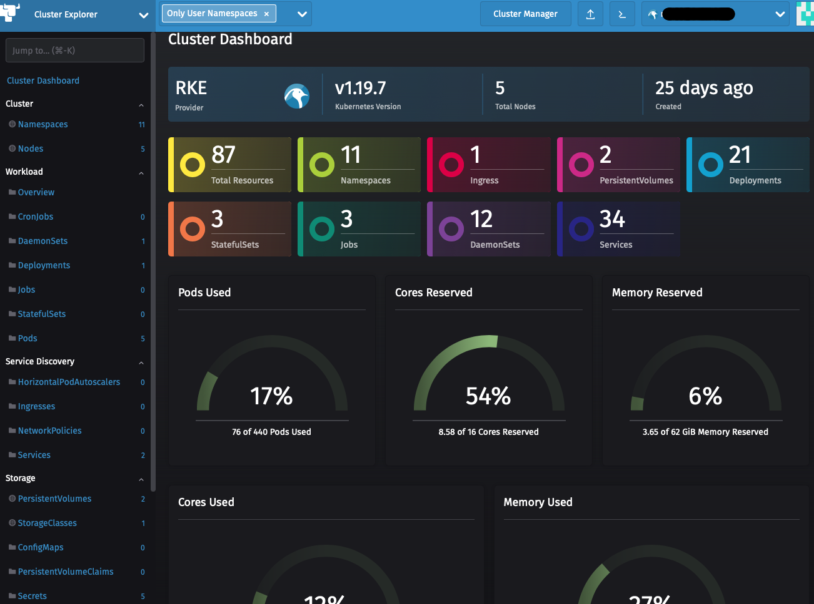

# Rancher
Rancher est souvent confondu avec une distribution Kubernetes. Ce n'en est pas une ! 

C'est un outil qui permet de créer/piloter/accéder des clusters Kubernetes et leur resource.
Côté création de cluster, Rancher va s'appuyer sur la distribution Kubernetes maison RKE ou K3S (suze) ou même sur d'autres GKE, EKS.
Une fois le ou les clusters Kubernetes ajoutés, Rancher est une IHM qui permet également de proxyfier certains services et d'en filtrer les accès.
Il offre également un explorateur pour regarder les ressources de vos clusters, et aussi une intégration avec certains outils tel que le Monitoring (Grafana/Prometheus) La persistence avec Longhorn, des règles avec GateKeeper,...

